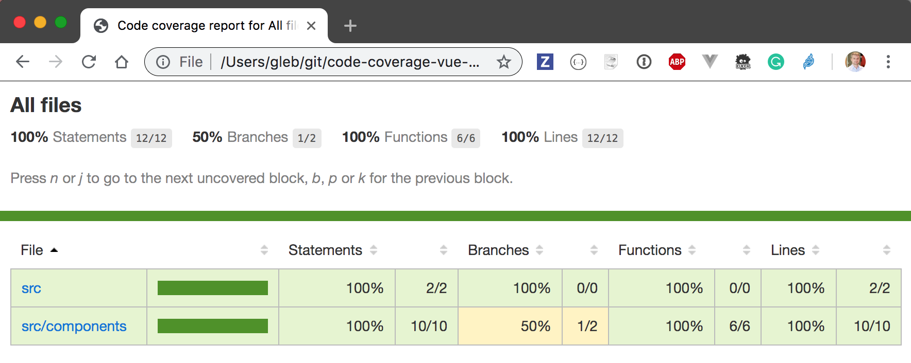
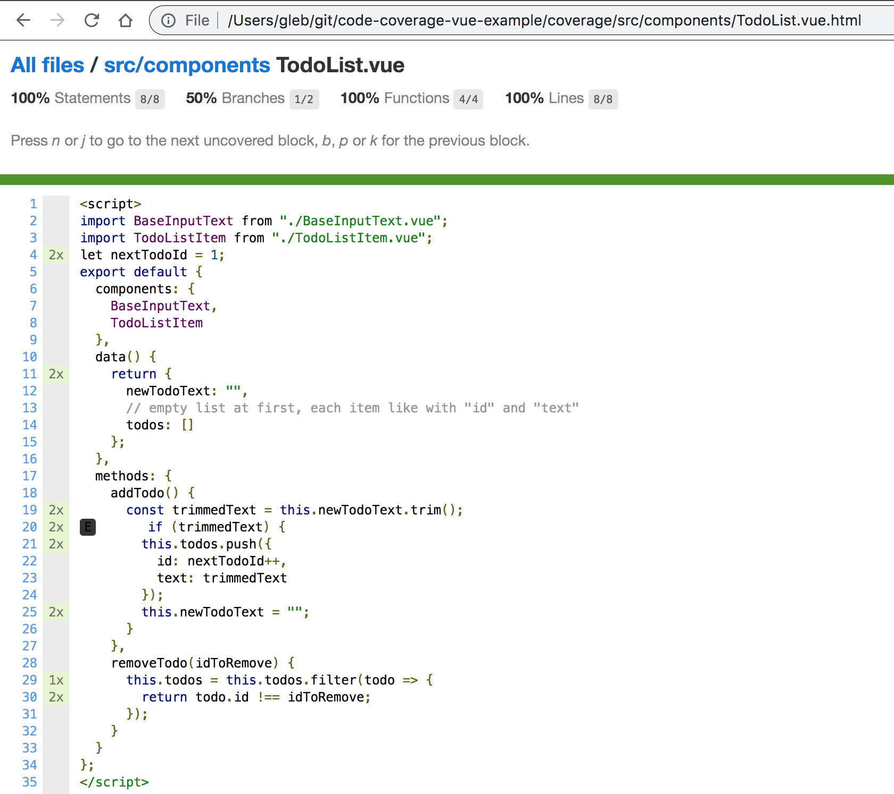

# code-coverage-vue-example [![renovate-app badge][renovate-badge]][renovate-app] [](https://circleci.com/gh/bahmutov/code-coverage-vue-example/tree/master) [](https://coveralls.io/github/bahmutov/code-coverage-vue-example)
> Code coverage for Vue single file components from Cypress.io end-to-end tests

Uses [@cypress/code-coverage](https://github.com/cypress-io/code-coverage) plugin for [Cypress.io](https://www.cypress.io) test runner. See [https://on.cypress.io/code-coverage](https://on.cypress.io/code-coverage) documentation.



Individual `.vue` file coverage



Because this application is served using `webpack-dev-server, it instruments the application code following the example in [bahmutov/code-coverage-webpack-dev-server](https://github.com/bahmutov/code-coverage-webpack-dev-server) via [.babelrc](.babelrc) and [webpack.config.js](webpack.config.js) files.

## Coveralls

You can find the code coverage for this project at [https://coveralls.io/github/bahmutov/code-coverage-vue-example](https://coveralls.io/github/bahmutov/code-coverage-vue-example). To send the coverage information there:

- install [coveralls](https://github.com/nickmerwin/node-coveralls) npm module with `npm i -D coveralls`
- add npm script to [package.json](package.json)
```json
{
  "scripts": {
    "coveralls": "nyc report --reporter=text-lcov | coveralls"
  }
}
```
- after the tests call the above command, see [.circleci/config.yml](.circleci/config.yml)
```
- run: npm run coveralls
```
- on CircleCI set two environment variables
```
COVERALLS_REPO_TOKEN=... (token from Coveralls.io)
COVERALLS_SERVICE_NAME=circleci
```

## License

This project is licensed under the terms of the [MIT license](/LICENSE.md).

[renovate-badge]: https://img.shields.io/badge/renovate-app-blue.svg
[renovate-app]: https://renovateapp.com/
